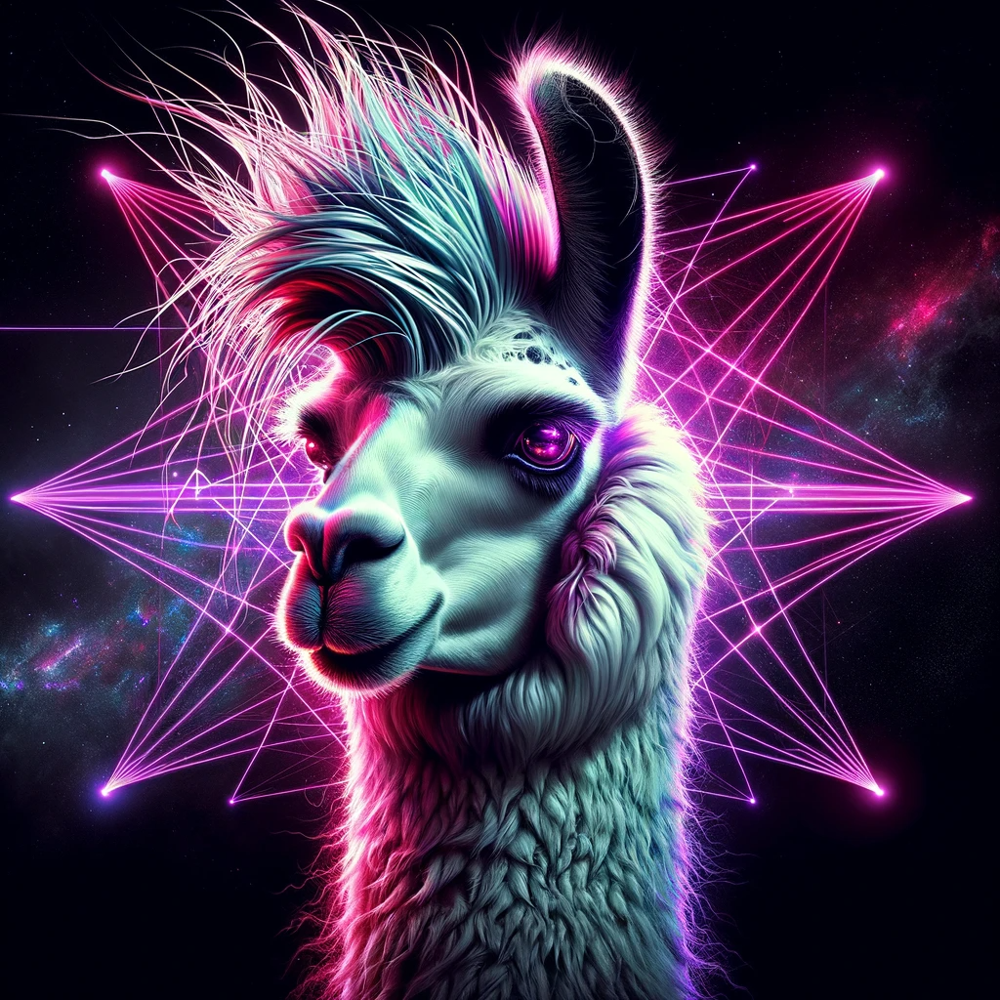

# codellama



## Project Objective:
The prime focus of my codellama project is to fine-tune the Code Llama 7B model and juxtapose its performance with GPT-4. Utilizing the stack outlined below, I dive into an extensive analysis, providing a robust framework for further work with the Code Llama model.

## Technology Stack:
- **Python:** The backbone of the project, used for scripting and handling various tasks.
- **Requests:** Library for sending HTTP requests, integrated in `completions.py`.
- **OpenAI:** Utilized for interfacing with GPT-4.
- **Torch:** A core component used for building and training the Code Llama 7B model.
- **Flask:** Employed for rendering the user interface and handling HTTP requests/responses.

## Code Overview:

### completions.py
This script is central to managing API interactions, GPU memory monitoring, and initiating text generation tasks. Key functions include `generate_gpt4_response` which orchestrates the entire process of text generation based on the input prompt and modality (GPT-4 or CodeLlama 7B). GPU memory stats are meticulously monitored and logged to ensure optimal performance.

### main.py
The Flask application is initialized here, with routes defined for rendering the main page and handling text completion requests. The `get_completion` route triggers the text generation process and responds with the generated text or an error message.

### prompts.py
Contains predefined prompts utilized in `completions.py` to guide the text generation process.

## Code:

The project is structured into various Python scripts, each serving a unique purpose:

- **completions.py:** Manages API interactions, GPU memory monitoring, and initiates text generation tasks.
- **main.py:** Initializes the Flask application, defines routes for rendering the main page, and handles text completion requests.
- **prompts.py:** Holds predefined prompts for guiding the text generation process.

Below are snippets of code from the aforementioned scripts:

#### completions.py
```python
...
def generate_gpt4_response(
        prompt, 
        modality, 
        api_key, 
        ckpt_dir, 
        tokenizer_path, 
        max_seq_len=256,
        ...
    ):
    ...
    if modality == "gpt-4":
        ...
    elif modality == "codellama-7b":
        ...
```

#### main.py
```python
...
@bp.route('/get_completion', methods=["POST"])
def get_completion():
    ...
    response = generate_gpt4_response(prompt, modality, api_key, ckpt_dir, tokenizer_path)
    ...
```

#### prompts.py
```python
...
# codellama-7b
USER_PROMPT_LLAMA = """
{prompt}. 
"""
```

## References:

- [Torch Documentation](https://pytorch.org/docs/stable/index.html)
- [OpenAI API Documentation](https://platform.openai.com/docs/api-reference/)
- [Requests Documentation](https://docs.python-requests.org/en/latest/)
- [Flask Documentation](https://flask.palletsprojects.com/en/2.1.x/)

For further insights and extended analysis, please refer to my website [johncollins.ai](https://johncollins.ai).

### License
codellama is released under the MIT License.
